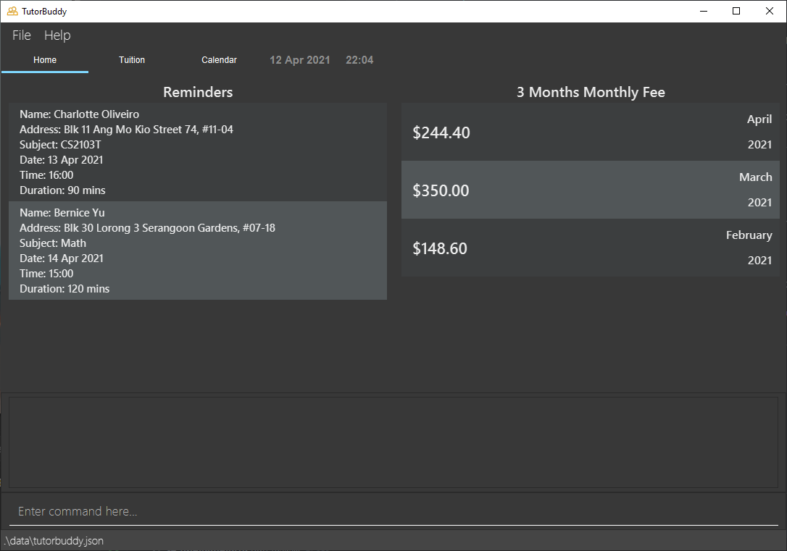
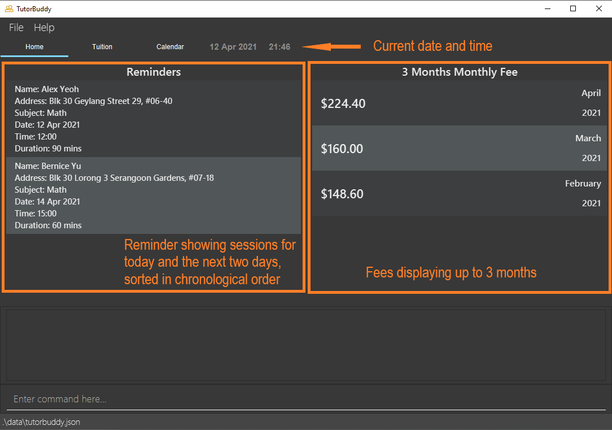
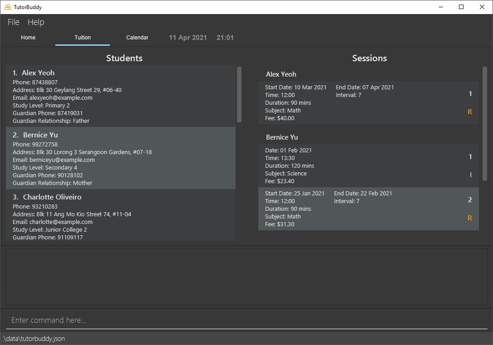
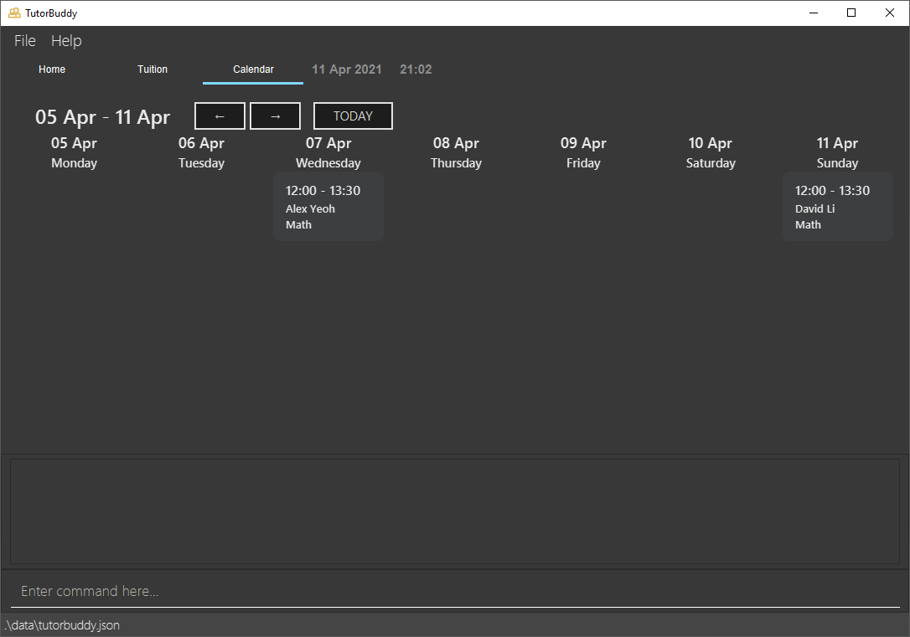
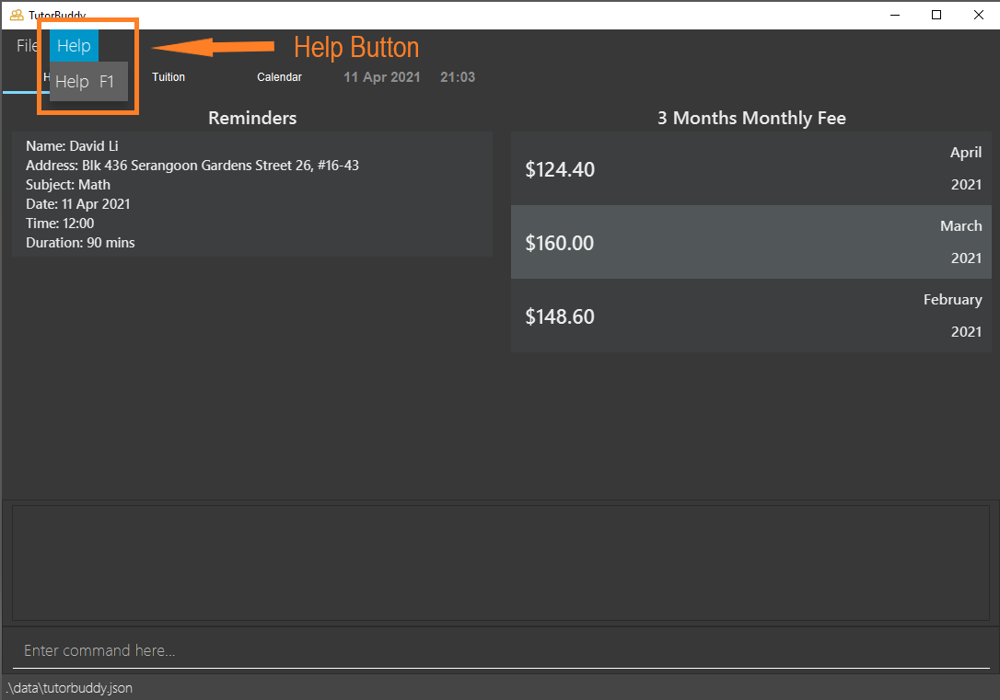

  

# TutorBuddy - User Guide

* Table of Contents
{:toc}

--------------------------------------------------------------------------------------------------------------------

## 1. **Introduction**
TutorBuddy is a desktop application made for freelance tutors who give one-to-one tuition to efficiently manage their students' contacts,
provide a quick overview of scheduled tuition sessions, and handle monthly tuition fees calculation.
TutorBuddy is also optimized for fast typing users to handle their day-to-day administrative responsibilities
effectively.

--------------------------------------------------------------------------------------------------------------------
## 2. **About**
This user guide provides documentation on the installation and usage of TutorBuddy.
It also provides a comprehensive description of features available to you and
includes a [quick-start](#quick-start) section that helps you get started.

This guide uses the following features to make it easier for you to navigate around:

* Words that look like [this](#about) can be clicked to jump to the related section.
* Words that look like `this` refer to keywords used as part of commands or responses from TutorBuddy.
* Words that look like <kbd>this</kbd> refer to keyboard keys that you can press.

Boxes with the :information_source: icon contain additional useful information.

Boxes with the :bulb: icon contain additional tips and tricks to help you get the most out of TutorBuddy.

--------------------------------------------------------------------------------------------------------------------

## 3. **Quick start**
This section provides information on how to quickly start using TutorBuddy.

### 3.1 Installation
Here are a few steps to get you started on TutorBuddy:

1. Ensure you have **Java 11** or above installed in your computer.

2. Download the latest version of TutorBuddy [here](https://github.com/AY2021S2-CS2103T-T11-1/tp/releases).

3. Move the downloaded TutorBuddy to a folder of your choice. This will be known as the home folder of TutorBuddy.

4. Double-click the file to start the application. An application similar to the one below should appear in a few
   seconds. 

### 3.2 Using TutorBuddy

This section offers an overview of the layout in TutorBuddy.

There are three main areas in TutorBuddy:

1. Utility area

2. Main viewing area

3. Result display box and command box

1. The utility area consists of 2 tabs: **File**, and **Help**.
    * The **File** tab consists of an exit button. To exit TutorBuddy, click on the exit button. Alternatively, use the `exit` command to exit the application.
    * The **Help** tab consists of a help button. If you require any assistance, click on the help button, copy the link displayed and paste it into any web browser.
    Alternatively, press <kbd>F1</kbd> to bring up the help window.

2. The main viewing area consists of 3 tabs: **Home**, **Tuition** and **Calendar**.
    * The **Home** tab gives tutors a quick overview of important matters. This includes their upcoming tuition lessons, as well as tuition fees receivable for the past 3 months.
    * The **Tuition** tab allow tutors to view and manage their students and lessons.
    * The **Calendar** tab allow tutors to have a weekly view of all sessions.

3. The command box is the area for you to enter your commands. The result of each command will be shown in the result
   display box, which is located directly above the command box. This area is always present in all tabs.
    * Type a command in the command box and press <kbd>Enter</kbd> to execute it. 

  Here are some example commands you can try:
  * **`list`** : Lists all students and sessions.
  * **`add_student`** `n/John Doe p/98765432 e/johnd@example.com a/John street, Block 123, #01-01 l/Sec2 g/95421323 r/Mother` : Adds a student named `John Doe`
    to TutorBuddy.
  * **`delete_student`** `3` : Deletes the 3rd student shown in the Student section.
  * **`add_session`** `n/John Doe d/2021-01-01 t/13:00 k/120 s/Biology f/80`: Adds a single tuition session for John Doe happening on 2021-01-01
  * **`add_rec_session`** `n/John Doe d/2021-01-01 t/18:00 k/120 s/Biology f/80 b/7 e/2021-01-15`: Adds a 7-day recurring session for John Doe happening from 2021-01-01 to 2021-01-15
  * **`exit`** : Exits the application. 

Refer to the [Commands](#commands) below for details of each command.

--------------------------------------------------------------------------------------------------------------------

## 4 **Features**

### 4.1 View

TutorBuddy allows the user to take full control of managing their students and tuition sessions with the following 3 views:
1. Home
2. Tuition 
3. Calendar

#### 4.1.1 Home
The Home page is split into two views: **Reminder** and **Monthly Fees**.

##### Reminder
The Reminder section displays tuition sessions within 3 days of the current date. Namely today, tomorrow and the day after tomorrow.

##### 3 Months Monthly Fee
The 3 Months Monthly Fees section displays tuition fees for the current month and the past two months.

:information_source:
Note: The current month and past two months are calculated when the user first opens the application. No other months can be added to this section.

#### 4.1.2 Tuition
The Tuition page is split into two views: **Student** and **Session**.

##### Student
The Student section displays students in TutorBuddy.

##### Session
The Session section displays sessions corresponding to each student.

#### 4.1.3 Calendar
The Calendar section provides a weekly view of all tuition sessions in TutorBuddy.

The left and right arrow allows you to view past and future tuition sessions. 
Click the 'Today' button to be brought back to this week's view.

### 4.2 Commands

Commands are the main way you interact with TutorBuddy.

This section provides information about all commands that is available in TutorBuddy.

#### 4.2.1 Command Format

**:information_source: Notes about the command format:** 

This section details the format of the commands available in TutorBuddy. We will adhere to the following:

* Words in `UPPER_CASE` are the parameters to be supplied by the user. 
  e.g. in `add_student n/NAME`, `NAME` is a parameter which can be used as `add n/John Doe`.

* Items in square brackets are optional. 
  e.g. `find_student KEYWORD [MORE_KEYWORDS]` can be used as `find_student John Samuel` or as `find_student John`.

* Parameters can be in any order. 
  e.g. if the command specifies `n/NAME p/PHONE_NUMBER`, `p/PHONE_NUMBER n/NAME` is also acceptable.

* If a parameter is expected only once in the command but you specified it multiple times, only the last occurrence of the parameter will be taken. 
  e.g. if you specify `p/98765432 p/99999999`, only `p/99999999` will be taken.

* Extraneous parameters for commands that do not take in parameters (such as `emails`, `help`, `exit`, `clear` and `list`) will be ignored. 
  e.g. if the command specifies `help 123`, it will be interpreted as `help`.

* Indexes **must be positive whole numbers** 1, 2, 3, …

* The `STUDENT_INDEX` refers to the index number shown in the [displayed student list](#application-overview).

* The `SESSION_INDEX` refers to the index number shown in the [displayed session list](#application-overview).

* Time must be input in the format, `hh:mm`.
  e.g. `13:00` is allowed, but not `1300`.
  
* Date must be input in the format, `yyyy-mm-dd`.
  e.g. `2021-01-01` is allowed, but not `01-01-2021`.

The following subsections will elaborate on the specific details of each TutorBuddy's command.

#### 4.2.2 General

##### Viewing help : `help`

Displays URL to TutorBuddy's User Guide and a list of all commands and their usages.

Format: `help`

##### Listing all students and sessions: `list`

Displays list of all students and all sessions in TutorBuddy.

Format: `list`  

##### Clearing all data : `clear`

Clears all student and session data.

:bulb: Tip:
TutorBuddy provides sample data to allow you to try out the application easily.  
Run the <code>clear</code> command to start working with TutorBuddy in a clean slate.

Format: `clear`

##### Exit the program: `exit`

Exits the program

Format: `exit`

#### 4.2.3 Managing Students

##### Adding a student: `add_student`

Adds a student to TutorBuddy.

Format: `add_student n/NAME p/STUDENT_PHONE_NUMBER e/EMAIL a/ADDRESS l/STUDY_LEVEL g/GUARDIAN_PHONE_NUMBER r/RELATIONSHIP_WITH_GUARDIAN`  

:information_source: <code>STUDENT_PHONE_NUMBER</code>, <code>GUARDIAN_PHONE_NUMBER</code> should be in Singapore's phone formatting (i.e. starting with either 6, 8 or 9 and with 8 digits).
:information_source: TutorBuddy automatically shows the full list of students and sessions after a successful <code>add_student</code> command.

Example:
* `add_student n/John Doe p/98765432 e/johnd@example.com a/John street, Block 123, #01-01 l/Sec2 g/95421323 r/Mother`

##### Locating student by name: `find_student`

Find student(s) whose names contain any of the given keywords.

Format: `find_student KEYWORD [MORE_KEYWORDS]`
* The search will be case-insensitive. e.g. searching `john` will match `JOHN`
* Only the name of students can be searched
* The order of the keywords does not matter. e.g. `John Doe` will match `Doe John`
* Only full words will be matched e.g. `Do` will not match `Doe`
* Students with name matching at least one keyword will be returned (i.e. `OR` search)
  e.g. `John Doe` will return `John Tan`, `Peter Doe`

Example:

\# | Student Name
---- |---------
1 | John Lee
2 | Johnz Tan
3 | Jon Koh
4 | Samuel Lee

*Figure 1: Current State of Student List*

Example command usages from the current student list shown in Figure 1:

* `find_student John` returns "John Lee"
* `find_student Sam` returns nothing
* `find_student Lee` returns "John Lee" and "Samuel Lee"
* `find_student Johnz Lee` returns "John Lee", "Johnz Tan" and "Samuel Lee"

##### Editing a student: `edit_student`

Edits an existing student's detail(s) in TutorBuddy.

Format: `edit_student STUDENT_INDEX [n/NAME] [p/STUDENT_PHONE_NUMBER] [e/EMAIL] [a/ADDRESS] [l/STUDY_LEVEL] [g/GUARDIAN_PHONE_NUMBER] [r/RELATIONSHIP_WITH_GUARDIAN]`  
* `STUDENT_PHONE_NUMBER` and `GUARDIAN_PHONE_NUMBER` should be in Singapore's phone formatting (i.e. starting with either 6, 8 or 9 with 8 digits)

Examples:
* `edit_student 1 p/98825432 e/alexy@example.com a/Alex street, Block 123, #01-01` edits the student at index 1's `STUDENT_PHONE_NUMBER`, `EMAIL`, and `ADDRESS`

##### Deleting a student: `delete_student`

Deletes the specified student from TutorBuddy.

Format: `delete_student STUDENT_INDEX`  

:bulb: Tip:
Use <code>find_student</code> command to filter the list of students you want. 
The <code>STUDENT_INDEX</code> will be based on the current list. 
(E.g. If John Doe is the 500th student, instead of <code>delete_student 500</code>, you can use <code>find_student John Doe</code> and
<code>delete_student 1</code> if the John Doe you would like to delete is the 1st in the list)

Examples:
* `delete_student 2` deletes the 2nd student based on the current list of students

##### Listing students' emails based on current list: `emails`
Displays concatenated string of students' emails based on current list, separated by `;`. Useful for sending mass emails to students.

Format: `emails`

Example:

\# | Student Name | Email
---- |---------|------|
1 | John Lee | johnlee@gmail.com
2 | Johnz Tan | johnztan@gmail.com
3 | Jon Koh | jonkoh@gmail.com
4 | Samuel Lee | sam@gmail.com

*Figure 2.1 State of Student List After `list` command*

\# | Student Name | Email
---- |---------|------|
1 | John Lee | johnlee@gmail.com
2 | Jon Koh | jonkoh@gmail.com

*Figure 2.2 State of Student List After `find_student john jon` command*

* To get emails of all students (see Figure 2.1): `list` followed by `emails` returns `johnlee@gmail.com;johnztan@gmail.com;jonkoh@gmail.com;sam@gmail.com;`

* To get emails of specific students (see Figure 2.2): `find_student john jon` followed by  `emails` returns `johnlee@gmail.com;jonkoh@gmail.com;`

#### 4.2.4 Managing Sessions

##### Adding a single tuition session: `add_session`

Adds a single tuition session to TutorBuddy.

Format: `add_session n/STUDENT_NAME d/DATE t/TIME k/DURATION s/SUBJECT f/FEE`

* `STUDENT_NAME` should match the exact student’s name in TutorBuddy
* `DATE` should be the date of the session in `yyyy-mm-dd` format
* `DURATION` should be in minutes
* `FEE` should be the total tuition fee for 1 session of the given duration
    * TutorBuddy only accepts `FEE` within an acceptable range of values between 0 and 999999.99 (both inclusive) as we do not expect a single session to cost more than $999,999.99 or more.
    * `FEE` only allows values up to 2 decimal points only

:bulb: Tip:
TutorBuddy takes care of overlapping session for you by giving a gentle prompt, so you don't have to worry about it.

 

:information_source: Note that the [Time given in <code>DATE</code> + <code>DURATION</code>] should not exceed 23:59H of the same day. 
This is done as we do not except tutors to teach lessons beyond the day itself.

Example:
* `add_session n/John Doe d/2021-01-01 t/18:00 k/120 s/Biology f/80`

##### Adding a recurring tuition session: `add_rec_session`

Adds a recurring tuition session to TutorBuddy that allows you to specify the number of days between each recurring session.

Format: `add_rec_session n/STUDENT_NAME d/START_DATE e/END_DATE b/INTERVAL t/TIME k/DURATION s/SUBJECT f/FEE `

Arguments similar to `add_session` command except the following:
* `START_DATE` should be the date of the first session
* `END_DATE` should be the date of the last session
* `INTERVAL` is the number of days to the next session  
  e.g. `INTERVAL` = 7 for weekly sessions

Example:
* `add_rec_session n/John Doe d/2021-01-01 e/2021-01-29 b/7 t/18:00 k/120 s/Biology f/80` adds a weekly session that starts on
2021-01-01 and ends on 2021-01-29

##### Deleting a tuition session: `delete_session`

Deletes the specified tuition session from TutorBuddy.

Format: `delete_session n/STUDENT_NAME i/SESSION_INDEX`

* `STUDENT_NAME` should match the exact student’s name in TutorBuddy
* `SESSION_INDEX` refers to the session index for a particular student
* Deletes the tuition session at the specified `SESSION_INDEX`
* The index must be a positive integer 1, 2, 3, …​

Example:
* `delete_session n/John Lee i/1` deletes John Lee's **first** session

##### Deleting a recurring tuition session: `delete_rec_session`

Deletes a single session from an existing recurring tuition session of a specified student from TutorBuddy.
Spawns two recurring sessions that will span the period exclusively before and after the deleted single session.

Format: `delete_rec_session n/STUDENT_NAME i/SESSION_INDEX d/DATE t/TIME`

Arguments similar to `delete_session` command except the following:
* `DATE` should be the date of the single session to be deleted
* `TIME` should be the time of the single session to be deleted

:information_source: Note that the <code>DATE</code> and <code>TIME</code> should be a valid session date that belongs in the specified recurring session

Example:
* `delete_rec_session n/John Doe i/1 d/2021-03-31 t/18:00` deletes a valid single session dated 2021-03-31 18:00 
from an existing recurring session. This will spawn two recurring sessions that will span the period exclusively
before and after 2021-03-31 18:00

#### 4.2.5 Fees

##### Getting monthly fee for a particular student: `fee`

Gets the monthly fee for a particular student for a particular month and year.

Format: `fee n/STUDENT_NAME m/MONTH y/YEAR`

* `STUDENT_NAME` should match the exact student’s name in TutorBuddy
* `MONTH` should be a positive integer between 1 and 12 inclusive
* `YEAR` should be a positive integer between 1970 and 2037 inclusive

Example:
* `fee n/John Lee m/1 y/2021` returns John Lee monthly fee for January 2021

:information_source: Note that calculation of fee is only guaranteed to be accurate for totaled fees of up to $2,147,483,647. 
We do not expect a person to earn more than $2,147,483,647 a month, hence the fee calculation should be accurate for all actual users.

--------------------------------------------------------------------------------------------------------------------

## 5. **Command summary**

**General**

Action | Format
--------|------------------
**Help** | `help`
**List all students and sessions** | `list`
**Clear all students and sessions** | `clear`
**Exit TutorBuddy** | `exit`

**Students**

Action | Format | Examples (if applicable)
--------|------------------|-------
**Add** | `add_student n/NAME p/STUDENT_PHONE_NUMBER e/EMAIL a/ADDRESS l/STUDY_LEVEL g/GUARDIAN_PHONE_NUMBER r/RELATIONSHIP_WITH_GUARDIAN` | `add_student n/John Doe p/98765432 e/johnd@example.com a/John street, Block 123, #01-01 l/Sec2 g/95421323 r/Mother`
**Find** | `find_student KEYWORD [MORE_KEYWORDS]` | `find_student John Alex`
**Edit** | `edit_student STUDENT_INDEX [n/NAME] [p/STUDENT_PHONE_NUMBER] [e/EMAIL] [a/ADDRESS] [l/STUDY_LEVEL] [g/GUARDIAN_PHONE_NUMBER] [r/RELATIONSHIP_WITH_GUARDIAN]` | `edit_student 1 p/98825432 e/alexy@example.com a/Alex street, Block 123, #01-01`
**Delete** | `delete_student STUDENT_INDEX` | `delete_student 3`
**List students' emails based on current list** | `emails`

**Tuition Sessions**

Action | Format | Examples
--------|------------------|-------
**Add Single Session** | `add_session n/STUDENT_NAME d/DATE t/TIME k/DURATION s/SUBJECT f/FEE` | `add_session n/John Doe d/2021-01-01 t/18:00 k/120 s/Biology f/80`
**Add Recurring Session** | `add_rec_session n/STUDENT_NAME d/DATE e/LASTDATE b/INTERVAL t/TIME k/DURATION s/SUBJECT f/FEE` | `add_rec_session n/John Doe d/2021-01-01 e/2021-01-15 b/7 t/20:00 k/120 s/Geography f/80`
**Delete Session** | `delete_session n/STUDENT_NAME i/SESSION_INDEX` | `delete_session n/John Lee i/1`
**Delete Recurring Session** | `delete_rec_session n/STUDENT_NAME i/SESSION_INDEX d/DATE t/TIME` | `delete_rec_session n/John Doe i/1 d/2021-03-31 t/18:00`

**Fees**

Action | Format | Examples
--------|------------------|-------
**Check fee** | `fee n/STUDENT_NAME m/MONTH y/YEAR` | `fee n/John Lee m/1 y/2021`

--------------------------------------------------------------------------------------------------------------------

## 6. **FAQ**

**Q**: How do I transfer my data to another Computer? 
**A**: Install the app in the other computer and overwrite the empty data file it creates with the file that contains the data of your previous TutorBuddy home folder.

--------------------------------------------------------------------------------------------------------------------

## 7. **Glossary**

This glossary provides definitions for the special terms used in this user guide.

**Single Session:** One time session on a particular date.

**Recurring Session:** Repeating session that occurs every number of days.

**URL:** The address of a web page.

--------------------------------------------------------------------------------------------------------------------
